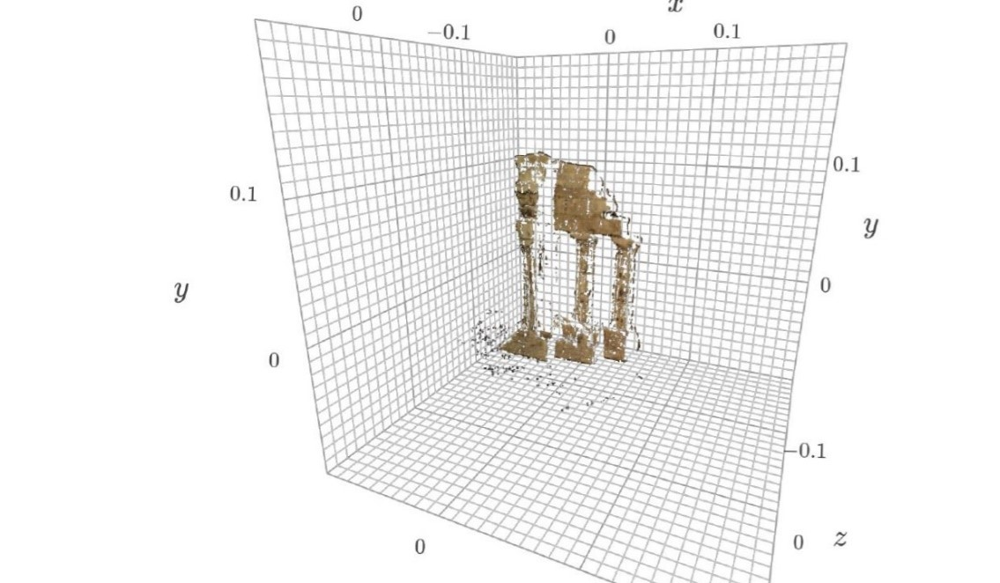
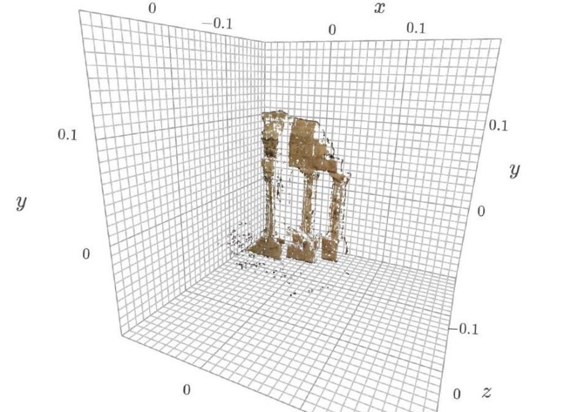
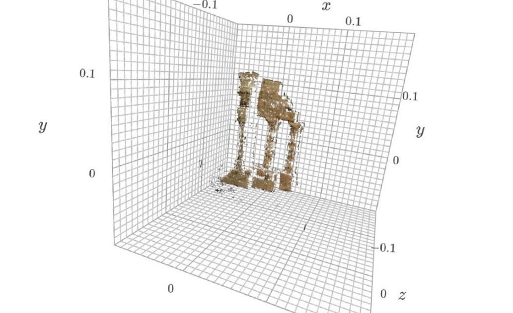
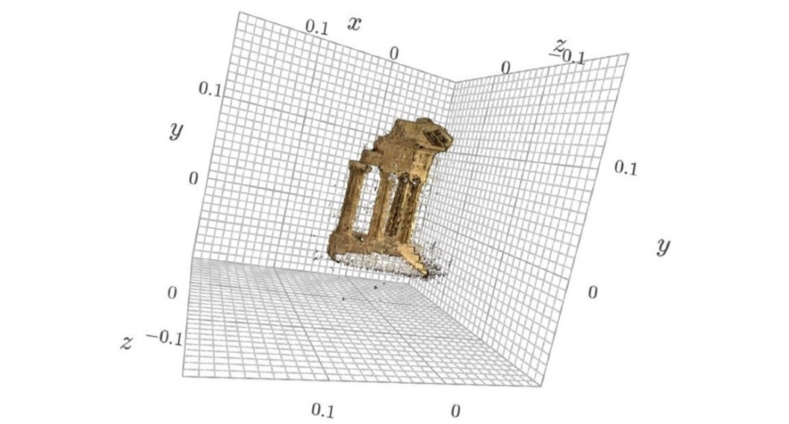

# 3D-Reconstruction using Plane Stereo and Multi-View Stereo

This is an implementation of stereo reconstruction and multi view stereo (plane sweep) algorithm from scratch. 

Two view stereo steps
- Rectify the views for simplygying the epipolar search line
- Compute disparity map using ssd,sad and zncc kernels
- Added LR consistency check for handling occlusion
- Reconstruction of the scene using disparity map and multi-pair aggregation

SAD

SSD

ZNCC

#### Multi view stereo 

In this method, we create a series of imaginary depth planes that are parallel to the reference view, and sweep them across a range of possible depths. For each depth plane, we project neighboring views onto it using a computed collineation, and then project these images back onto the reference view.

By repeating this process for each depth plane in the desired range, we construct a cost volume. This volume is created by stacking the resulting cost maps for each depth plane along the depth axis.

Finally, we obtain the depth map for the scene by identifying the minimum cost value at each pixel location in the cost volume. This depth map can then be used for 3D scene reconstruction.

<strong>Multi view stereo reconstruction</strong>

